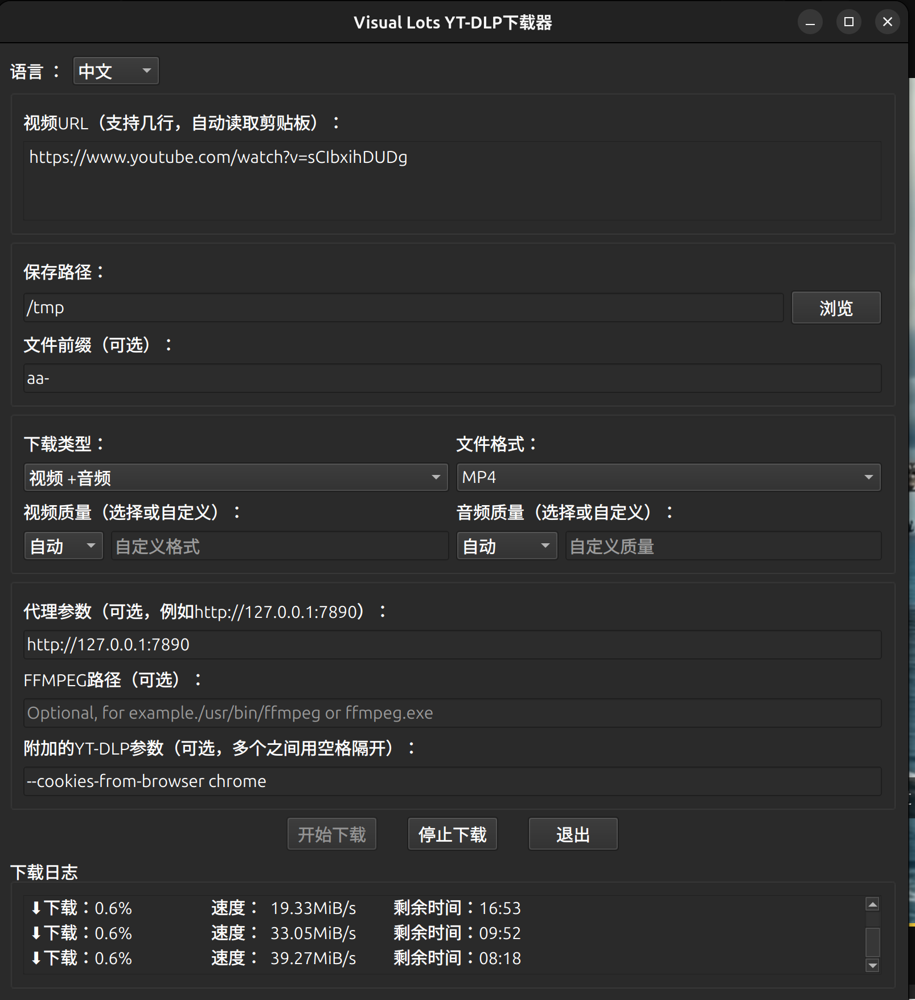

# YT-DLP Visual Batch Downloader

## 项目简介

YT-DLP Visual Batch Downloader 是一个基于 PyQt6 的图形化界面工具，旨在帮助用户通过 yt-dlp 下载视频、音频或字幕。该工具支持批量下载、多种格式选择、代理设置以及 FFmpeg 集成等功能，适合需要高效管理媒体下载的用户。

---

## 功能特点

- **批量下载**：支持从剪贴板自动读取多个 URL 并进行批量下载。
- **多语言支持**：内置多语言翻译功能，支持英语和其他语言（可通过扩展翻译文件添加更多语言）。
- **灵活的下载选项**：
  - 视频+音频同时下载。
  - 仅下载视频或音频。
  - 下载字幕。
- **自定义格式**：支持选择不同的视频和音频格式（如 MP4、MKV、MP3 等）。
- **质量选择**：提供多种分辨率和音质选项（如 8K、4K、2K、1080p、720p、320 kbps 等）。
- **高级设置**：
  - 支持代理服务器配置。
  - 支持 FFmpeg 路径设置。
  - 支持 yt-dlp 的额外参数输入。
- **日志记录**：实时显示下载进度和状态信息。
- 

---

## 使用方法

### 安装依赖

确保已安装以下依赖项：

- Python 3.7 或更高版本
- PyQt6
- yt-dlp
- pyperclip

可以通过以下命令安装依赖项：

```
bash
pip install pyqt6 yt-dlp pyperclip
```
### 运行程序

运行主程序文件 `yt_dlp_gui.py`：

```
bash
python yt_dlp_gui.py
```
### 界面操作

1. **输入 URL**：
   - 在 "Video URL" 输入框中粘贴或手动输入视频链接（支持多行输入）。
   - 程序会自动从剪贴板读取 URL。

2. **选择保存路径**：
   - 在 "Save Path" 中设置下载文件的保存位置。
   - 可以点击 "Browse" 按钮选择文件夹。

3. **设置文件前缀**：
   - 可选地为文件名添加前缀（如日期或时间戳）。

4. **选择下载类型**：
   - 视频+音频、仅视频、仅音频或仅字幕。

5. **选择格式和质量**：
   - 根据下载类型选择对应的视频或音频格式及质量。

6. **高级设置**：
   - 配置代理服务器地址。
   - 设置 FFmpeg 的路径（如果需要）。
   - 输入 yt-dlp 的额外参数（如 `--no-playlist` 或 `--embed-subs`）。

7. **开始下载**：
   - 点击 "Start Download" 按钮开始下载任务。
   - 如果需要停止下载，可以点击 "Stop Download" 按钮。

8. **查看日志**：
   - 下载进度和状态信息会实时显示在 "Download Log" 区域。

---

## 配置文件

程序会在运行目录下生成一个 `config.json` 文件，用于保存用户的设置。下次启动时会自动加载这些设置。

### 配置文件示例

```
json
{
    "path": "/home/user/Downloads",
    "prefix": "Date: 20231005",
    "download_type": "Video Only",
    "video_format": "mp4",
    "audio_format": "mp3",
    "video_quality": "1080p",
    "audio_quality": "320 kbps",
    "proxy": "http://127.0.0.1:7890",
    "ffmpeg_path": "/usr/bin/ffmpeg",
    "language": "en",
    "extra_params": "--no-playlist --embed-subs"
}
```
---

## 多语言支持

程序支持多语言界面，语言文件存储在 `lang` 目录下，格式为 JSON。默认支持英语，其他语言可以通过扩展翻译文件实现。

### 添加新语言

1. 在 `lang` 目录下创建一个新的 JSON 文件，文件名为语言代码（如 `zh.json` 表示中文）。
2. 根据模板填充翻译内容。例如：

```
json
{
    "language_name": "Chinese",
    "language_simple": "zh",
    "window_title": "YT-DLP 图形化批量下载器",
    "url_label": "视频 URL（支持多行，自动读取剪贴板）：",
    "download_button": "开始下载",
    "stop_button": "停止下载",
    "exit_button": "退出",
    "download_types": ["视频+音频", "仅视频", "仅音频", "仅字幕"]
}
```
---

## 注意事项

- 确保系统已正确安装 yt-dlp 和 FFmpeg（如果需要）。
- 如果使用代理，请确保代理服务器地址正确无误。
- 下载过程中不要关闭程序，否则可能导致下载中断。

---

## 联系与反馈

如果有任何问题或建议，请联系开发者或提交 Issue。
 
**GitHub 仓库**：https://github.com/yourusername/yt-dlp-gui

---

