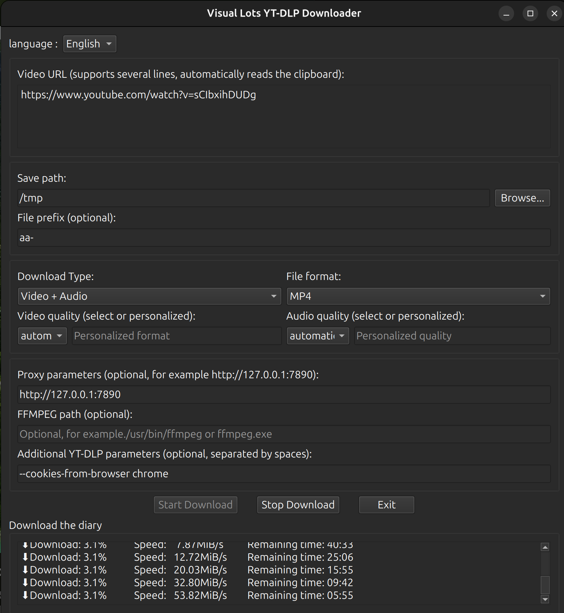

---
# YT-DLP Visual Batch Downloader

## Project Overview

YT-DLP Visual Batch Downloader is a graphical interface tool based on PyQt6, designed to help users download videos, audio, or subtitles using yt-dlp. This tool supports batch downloading, multiple format selections, proxy settings, and FFmpeg integration, making it ideal for users who need efficient management of media downloads.

---

## Features

- **Batch Download**: Automatically reads multiple URLs from the clipboard and performs batch downloads.
- **Multi-language Support**: Built-in multi-language translation functionality, supporting English and other languages (more languages can be added via extending translation files).
- **Flexible Download Options**:
  - Download both video and audio.
  - Download only video or audio.
  - Download subtitles.
- **Custom Formats**: Supports choosing different video and audio formats (e.g., MP4, MKV, MP3, etc.).
- **Quality Selection**: Offers various resolution and audio quality options (e.g., 8K,4K,2K,1080p, 720p, 320 kbps, etc.).
- **Advanced Settings**:
  - Supports proxy server configuration.
  - Supports FFmpeg path settings.
  - Supports input of additional yt-dlp parameters.
  - Supports custom yt-dlp parameters.
  - Supports Windows, macOS, and Linux.
- **Logging**: Displays real-time download progress and status information.



---

## How to Use

### Install Dependencies

Ensure the following dependencies are installed:

- Python 3.7 or higher
- PyQt6
- yt-dlp
- pyperclip

You can install the dependencies using the following command:

```bash
pip install pyqt6 yt-dlp pyperclip
```

### Run the Program

Run the main program file `yt_dlp_gui.py`:

```bash
python yt_dlp_gui.py
```

### Interface Operations

1. **Enter URL**:
   - Paste or manually enter the video URL in the "Video URL" input box (multi-line input is supported).
   - The program will automatically read URLs from the clipboard.

2. **Choose Save Path**:
   - Set the download location in the "Save Path" field.
   - You can click the "Browse" button to choose a folder.

3. **Set File Prefix**:
   - Optionally, add a prefix to the file name (e.g., date or timestamp).

4. **Select Download Type**:
   - Choose from video+audio, video only, audio only, or subtitles only.

5. **Select Format and Quality**:
   - Choose the corresponding video or audio format and quality based on the download type.

6. **Advanced Settings**:
   - Configure proxy server address.
   - Set the FFmpeg path (if needed).
   - Enter additional yt-dlp parameters (e.g., `--no-playlist` or `--embed-subs`).

7. **Start Download**:
   - Click the "Start Download" button to begin the download task.
   - If you need to stop the download, click the "Stop Download" button.

8. **View Logs**:
   - Download progress and status information will be displayed in the "Download Log" area.

---

## Configuration File

The program will generate a `config.json` file in the running directory to save the user settings. These settings will be loaded automatically the next time the program starts.

### Sample Configuration File

```json
{
    "path": "/home/user/Downloads",
    "prefix": "Date: 20231005",
    "download_type": "Video Only",
    "video_format": "mp4",
    "audio_format": "mp3",
    "video_quality": "1080p",
    "audio_quality": "320 kbps",
    "proxy": "http://127.0.0.1:7890",
    "ffmpeg_path": "/usr/bin/ffmpeg",
    "language": "en",
    "extra_params": "--no-playlist --embed-subs"
}
```

---

## Multi-language Support

The program supports multi-language interfaces, with language files stored in the `lang` directory in JSON format. English is the default, and other languages can be added by extending the translation files.

### Adding a New Language

1. Create a new JSON file in the `lang` directory, naming it with the language code (e.g., `zh.json` for Chinese).
2. Fill in the translation content based on the template. For example:

```json
{
    "language_name": "Chinese",
    "language_simple": "zh",
    "window_title": "YT-DLP GUI Downloader",
    "url_label": "Video URL：",
    "download_button": "start download",
    "stop_button": "stop download",
    "exit_button": "exit",
    "download_types": ["video+audio", "only video", "only audio", "only subtitles"]
}
```

---

## Notes

- Make sure yt-dlp and FFmpeg are correctly installed (if needed).
- To install yt-dlp please refer to the official documentation。https://github.com/yt-dlp/yt-dlp
- To install FFmpeg please refer to the official documentation。https://ffmpeg.org/download.html
- If using a proxy, ensure the proxy server address is correct.
- Do not close the program during the download process, as it may interrupt the download.

---

## Contact & Feedback

If you have any questions or suggestions, please contact the developer or submit an issue.

**GitHub Repository**: https://github.com/syd168/yt-dlp-gui

---